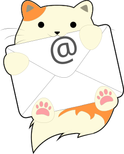
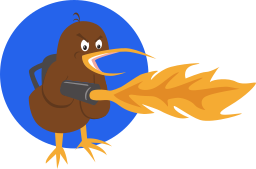

# TrashMails

> Personal project, built with AI assistance (Claude Code). No store release is planned: releases are
> published here on GitHub only (installable with [Obtainium](https://github.com/ImranR98/Obtainium)).
> See [CHANGELOG.md](CHANGELOG.md) for what changed in each version.

Android app to create and read disposable email inboxes from free providers:

| | Provider | Address | Notes | Privacy | Source |
|---|---|---|---|---|---|
|  | [Inbox Kitten](https://inboxkitten.com) | `name@inboxkitten.com` (custom or random name) | Public inbox, emails kept ~3 days | none published | [open](https://github.com/uilicious/inboxkitten) |
|  | [Maildrop](https://maildrop.cc) | `name@maildrop.cc` (custom or random name) | Public inbox, 10 messages max, emptied after 24 h without mail, manual deletion | [policy](https://maildrop.cc/privacy/) | [open](https://github.com/m242/maildrop) |
|  | [Burner Kiwi](https://burner.kiwi) | random, generated by the server | **Unavailable** — see below | none published | [open](https://github.com/haydenwoodhead/burner.kiwi) |
|  | [Guerrilla Mail](https://www.guerrillamail.com) | `name@<domain>` (custom or random name; 11 interchangeable domains, optional scrambled alias) | Public inbox, emails kept 1 hour, manual deletion | [in the terms](https://www.guerrillamail.com/tos) | closed |
|  | [mail.tm](https://mail.tm) | `name@<domain>` (custom or random name, domain chosen by mail.tm) | **Private** inbox (account + password), emails kept 7 days, manual deletion, account deleted on removal | [policy](https://mail.tm/en/privacy/) | closed |
|  | [tempmail.lol](https://tempmail.lol) | `prefix` + random suffix `@<random domain>` (subdomain optional) | **Private** inbox (token), alive 1 hour; emails are handed over once and kept in the app | [policy](https://tempmail.lol/privacy) | closed ([clients](https://github.com/tempmail-lol) are open) |
|  | [DropMail.me](https://dropmail.me) | random name `@<domain>` (random among 15 permanent domains, or chosen) | **Private** inbox (restore key); lives in a 10-minute session that every refresh extends, restored automatically once lapsed (mail sent meanwhile bounces); extended addresses `name-tag@sub.domain` reach the same inbox; emails kept in the app | [policy](https://dropmail.me/privacypolicy.html) | closed |

In the app, providers are grouped by source availability (open source first) and each one has an
(i) button showing its retention rules and links to the website, privacy policy and repository.

### Burner Kiwi is broken (checked September 2026)

Burner Kiwi is still listed in the app but greyed out. Its API works (an inbox and a token are
returned) but mail never arrives: of its three domains, `farcical.lol` and `hushed.space` no longer
exist (NXDOMAIN), and `deceit.pro` has its MX pointed at a generic Exim host that answers
`550 can't verify recipient` to every address. Nothing the app can do; it will be re-enabled if the
service comes back.

## Features

- Several inboxes side by side, persisted locally
- Auto-refresh while an inbox is open (every 30 s to 5 min, or manual; paused in the background), manual refresh (max once per 30 s)
- Emails shown as plain text by default; HTML rendering (JavaScript disabled, remote images blocked unless asked) globally or per message, dark mode
- Links are confirmed before leaving the app (site and full address shown), and only http(s) and mailto links can be opened
- Settings: render HTML, load remote images, confirm links, auto-refresh interval (30 s to manual), forget old addresses, block screenshots, theme, copy new addresses — privacy ones default to the safe side
- Copy the address or the message text to the clipboard
- Retention rules, website, privacy policy and source repository of each provider behind an (i) button (retention shown again when removing an address)
- Courtesy creation quota per rolling 24 h: 20 per provider (10 for mail.tm, 5 for Burner Kiwi)

No backend, no tracking: the app only talks to the providers' public APIs. What stays on the device, in the
app's private storage and excluded from Android backup (the app opts out altogether): the mail.tm account
password, the tempmail.lol inbox tokens, the DropMail.me device token and restore keys, and the emails of
the providers that keep none (tempmail.lol, DropMail.me), bodies included. Removing an address drops all of it.

## Build

Requires Android Studio (or a JDK and the Android SDK, API 37; Gradle provisions the JDK 25 toolchain it builds with).

```
./gradlew assembleDebug
```

The APK is written to `app/build/outputs/apk/debug/app-debug.apk`. Minimum Android version: 10 (API 29).

## Structure

```
app/src/main/java/io/github/usernamealreadytakensht/trashmails/
├── data/
│   ├── Models.kt            Provider enum, Inbox, MailSummary, MailProvider interface
│   ├── Http.kt              HttpApi + OkHttp implementation, name helpers
│   ├── Prefs.kt             The few SharedPreferences calls the stores use
│   ├── InboxStore.kt        Local persistence of inboxes
│   ├── ReadStore.kt         Read message ids and unread counts
│   ├── CreationQuota.kt     Per-provider creation rate limit
│   ├── Settings.kt          User preferences
│   ├── MimeText.kt          Text and HTML parts of a raw RFC 822 message
│   ├── MessageCache.kt      Local copy of the emails for the providers that keep none
│   └── providers/           One implementation per provider, registered in Providers.kt
├── ui/
│   ├── MailViewModel.kt     State, navigation, polling
│   ├── Messages.kt          Error wording, snackbar host
│   ├── HtmlText.kt          HTML email to plain text
│   ├── ProviderInfo.kt      Retention rules shown per provider
│   ├── ProviderLogo.kt      Provider logos
│   ├── Util.kt              Clipboard, date and duration formatting
│   └── screens/             Home, inbox, message and settings screens
└── ui/theme/                Material 3 theme
```

## Provider APIs used

- Inbox Kitten: `GET /api/v1/mail/list?recipient=`, `GET /api/v1/mail/getHtml?key=&region=`
- Guerrilla Mail: `ajax.php?f=set_email_user`, `f=get_email_list`, `f=fetch_email`, `f=del_email` with `sid_token`
- mail.tm: `GET /domains`, `POST /accounts`, `POST /token`, `GET /messages`, `GET /messages/{id}`, `DELETE /messages/{id}`, `DELETE /accounts/{id}` with a bearer token
- Burner Kiwi: `GET /api/v2/inbox`, `GET /api/v2/inbox/{id}/messages` with `X-Burner-Key`
- Maildrop: GraphQL at `https://api.maildrop.cc/graphql` (`inbox`, `message`, `delete`)
- tempmail.lol: `POST /v2/inbox/create` (`prefix`, `subdomain`), `GET /v2/inbox?token=` — the reply consumes the emails, so the app keeps them locally
- DropMail.me: `POST /api/token/generate` (a free `af_` token per device), then GraphQL at `https://dropmail.me/api/graphql/<token>` (`domains`, `introduceSession`, `session`, `restoreAddress`, `sessions`) — mail lives with the 10-minute session, so the app keeps it locally

Provider logos are the services' own artwork (SVGs rasterized, or their favicon/wordmark when that is all they publish).
